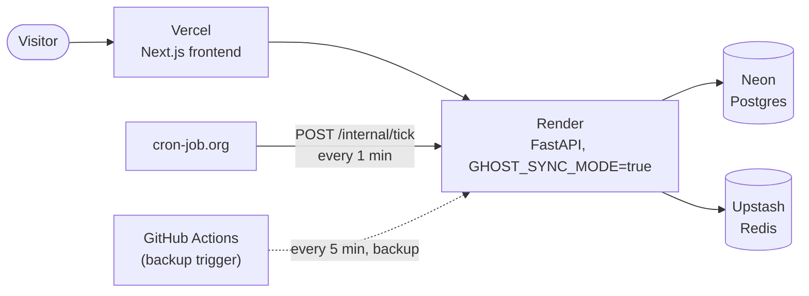

# Ghost Protocol

**Observe. Model. Detect. Simulate.**

**[Live demo](https://ghost-protocol-emp.vercel.app/)** -- public workspace, synthetic traffic on a
real 10-minute healthy/incident cycle, no signup needed.

Behavioral engineering platform for production systems. Ingests
telemetry, builds a live behavioral model, finds structural
bottlenecks and incidents, correlates failures across dependencies,
and runs statistical what-if simulations.

It answers:

> What's happening, what changed, what's connected to it, and what
> does the data predict happens next?

## Deployment architecture



No persistent worker process -- see [Free-tier deployment](#free-tier-deployment-no-persistent-worker)
below for why, and what replaces it.

## Measurement, not explanation

Ghost derives what it can from observable behavior -- baselines,
dependency structure, anomalies, the statistically expected effect of
a change. It stops short of asserting root cause.

"Historical data suggests changing X is associated with Y" -- that's
analysis, and that's what Ghost does. "Therefore X is the root cause"
is a different claim, and Ghost doesn't make it. The simulation engine
(`app/simulation/engine.py`) reports statistical projections with the
method used, no causal claims. Nothing in this repo generates a "root
cause" statement.

## Core loop

```
PRODUCTION SYSTEM
      │
      ▼
  INGESTION
      │
      ▼
BEHAVIORAL MODEL ── baselines / dependencies / capacity
      │
      ▼
STRUCTURAL ANALYSIS (bottleneck engine)
      │
      ▼
ANOMALY DETECTION
      │
      ▼
INCIDENT CORRELATION
      │
      ▼
   EVIDENCE
      │
      ▼
  SIMULATION
      │
      ▼
QUANTIFIED RESULTS
```

## What's implemented

| Component | Status | Where |
|---|---|---|
| OTLP ingestion (traces + metrics, JSON) | done | `app/ingestion/`, `app/api/routes/ingest.py` |
| Behavioral graph (auto-discovered nodes/edges) | done | `app/graph/topology.py`, `app/graph/repo.py` |
| Dual baselines (fast "current" EWMA vs slow "reference" snapshot) | done, scheduled hourly | `app/graph/baseline.py`, `app/graph/reference.py` |
| Bottleneck engine (fan-in/fan-out, critical-path, risk score) | done | `app/bottleneck/engine.py`, `/v1/bottlenecks` |
| Per-service risk baseline (same current/reference split, applied to a service's own risk score -- flags "unusual for this service," not one fixed cutoff for everyone) | done | `app/bottleneck/baseline.py`, `app/bottleneck/reference.py` |
| Anomaly detection (z-score vs reference baseline) | done | `app/incident/detect.py` |
| Incident correlation (union-find across the graph, matched on `last_seen_at` so an ongoing incident doesn't silently split into duplicates) | done | `app/incident/correlate.py` |
| Deployment markers + correlation | done | `app/models/deployment.py`, `POST /v1/deployments` |
| Simulation (statistical mean-reversion + blast radius, 95% CI on improvement) | done, scoped | `app/simulation/engine.py` |
| Cohort comparison (concurrent canary/rollout traffic, self-joined from raw spans, zero ingestion changes) | done | `app/cohort/`, `POST/GET /v1/cohort-dimensions`, `GET /v1/cohort-analysis` |
| Evidence layer (structured schema: observations/dependencies/timeline/deployments/simulation) | done | `app/evidence/`, `GET /v1/incidents/{id}/evidence` |
| Multi-workspace isolation, bearer API key auth/revocation | done | `app/api/deps.py`, `app/models/workspace.py` |
| Session-based dashboard login (Fernet-signed httpOnly cookie, real server-side revocation via Redis, separate from bearer ingestion auth) | done | `app/core/session.py`, `app/api/routes/auth.py` |
| Security hardening (CORS allowlist, per-IP login rate limiting, security headers, input validation) | done | `app/main.py`, `app/api/routes/auth.py` |
| Frontend dashboard (Next.js + TypeScript + Tailwind) | done, 10 pages real | `ghost-frontend/`, see below |
| Public demo seeding (synthetic traffic + real incident lifecycle on a schedule, through the real ingestion pipeline) | done, opt-in | `app/workers/tasks.py:seed_demo_workspace` |
| Public landing page (live preview before login, no auth required) | done | `GET /v1/public/demo-preview`, `ghost-frontend/src/app/page.tsx` |
| Sync-mode dispatch + `/internal/tick` (Celery beat substitute for free-tier hosting -- no persistent worker needed) | done | `app/core/dispatch.py`, `app/api/routes/internal.py` |
| Ingestion abuse protection (per-workspace rate limits, stricter for the public demo workspace, hard payload-size caps) | done | `app/api/routes/ingest.py` |
| Telemetry retention (prunes raw spans/metrics on a schedule, keeps derived state) | done | `app/ingestion/retention.py` |
| Per-workspace pipeline self-observability (freshness + recent-events log, not platform-wide infra metrics) | done | `app/models/pipeline_event.py`, `GET /v1/pipeline-health` |
| Services list (every discovered service, including ones gone quiet) | done | `GET /v1/services` |
| CI (backend tests, migration check, frontend build) on every push | done | `.github/workflows/ci.yml` |

## Free-tier deployment: no persistent worker

No mainstream host offers a genuinely free persistent background
worker in 2026 -- free tiers are for request-triggered web services,
and a worker with no HTTP endpoint doesn't fit that model. Rather than
pay for one, `GHOST_SYNC_MODE=true` makes every place that would
normally enqueue a Celery task (`dispatch()`, `app/core/dispatch.py`)
call it directly and synchronously instead. `POST /internal/tick`
(`app/api/routes/internal.py`) substitutes for Celery beat's entire
schedule in one endpoint, using the same deterministic wall-clock
cadence logic as the demo seeder -- no stored state, so it's correct
regardless of which process handles a given call or how often it's
missed. An external cron service pings it (primary: cron-job.org,
1-minute granularity; backup: a GitHub Actions workflow at Actions'
own 5-minute minimum). Verified with zero Celery processes running at
all -- see Tested.

Real production deployment under real load would want the persistent
worker back; this only makes sense for a free, low-traffic demo.

## Frontend

Next.js dashboard in `ghost-frontend/`, session-authenticated against
the backend above -- no separate auth system. A public landing page
at `/` shows a live preview of the demo workspace before login (no
auth needed for that one read); everything else needs a session.

Ten pages wired to live data, not mocked:

- **Overview** -- system status, a hero showing the single most urgent
  open incident (or all-clear), active-incident and top-bottleneck
  previews
- **Services** -- every service Ghost has ever discovered, including
  ones that have gone quiet -- built from the node table directly, not
  derived from current edges, so a service doesn't silently vanish the
  moment it stops appearing in fresh traffic
- **Incidents** (list + detail) -- filterable list, detail page with
  full evidence: observations, dependencies, live timeline, deployment
  context, mean-reversion simulation, cohort comparisons when they exist
- **Bottlenecks** -- every service's structural risk, top risk pulled
  out as its own instrument, rest as a ranked, z-score-annotated list
- **System Map** -- actual discovered topology, laid out by BFS
  call-depth (not hand-positioned), animated flow indicators,
  deviation-based coloring
- **Behavior** -- every edge's current-vs-reference latency and error
  rate, sorted by deviation from its own baseline
- **Deployments** -- every deploy a CI/CD pipeline has recorded, newest
  first, backing the correlation shown on incident evidence pages
- **Cohorts** -- auto-discovers real comparisons across every
  registered dimension and known edge, rather than making you pick a
  caller/callee/dimension combination manually; only surfaces what's
  statistically valid, everything else sits in a de-emphasized
  "gathering data" list
- **Pipeline Health** -- this workspace's own view of whether Ghost is
  actually watching its data right now (last data received, last
  successful scan, a recent-events log) -- deliberately scoped to one
  workspace, not platform-wide infrastructure metrics

Visual language: an "instrument panel" motif reused across the data
pages -- a tick-ring/rotating-orbit gauge for whatever number matters
most on that page (risk score, incident duration, deviation), glowing
corner reticles on the one featured panel, motion reserved for
actual deviating/critical states.

A public demo workspace, if configured (`GHOST_DEMO_WORKSPACE_ID` on
the backend), gets synthetic traffic and a real incident lifecycle
generated on a 10-minute cycle by `seed_demo_workspace`
(`app/workers/tasks.py`) -- through the same ingestion pipeline real
traffic uses, not hand-faked dashboard data. It also generates a real
canary-cohort split (`config.redis_ttl_seconds` 30 vs 300, the slower
cohort genuinely slower) and a real correlated deployment right before
each incident, so the Cohorts page and an incident's deployment
context both have something real to show on the public demo, not just
on a manually-seeded test workspace. The login page and landing page
both show a "View live demo" / "Explore the live demo" button whenever
`NEXT_PUBLIC_DEMO_API_KEY` is set at build time; otherwise it's absent
entirely.

Still stubbed: Integrations (workspace reasoning-service config is
gated behind the platform admin secret right now, not a per-workspace
session -- needs a backend change first), Settings.

## Evidence

Powers the dashboard and the incident API. `GET
/v1/incidents/{id}/evidence` assembles it into this shape
(`app/evidence/schema.py`, `app/evidence/builder.py`):

```json
{
  "incident": { "id": "incident-1842", "service": "checkout" },
  "observations": [
    { "metric": "checkout->redis latency_p99_ms", "baseline": 420.0, "current": 4800.0 }
  ],
  "dependencies": ["checkout->redis", "checkout->postgres"],
  "timeline": [
    { "kind": "incident_opened", "message": "...", "occurred_at": "..." }
  ],
  "deployments": [
    { "service_name": "checkout", "version": "v482", "deployed_at": "...", "minutes_before_incident": 4.2 }
  ],
  "simulation_results": []
}
```

Metric names carry the edge prefix (`"checkout->redis latency_p99_ms"`)
since anomalies are per-edge, not per-service. Deployments match by
service name within a 60-minute lookback before the incident's start;
nothing infers "this deployment caused it," it's surfaced as
correlated-in-time context. `POST /v1/deployments` is how a CI/CD
pipeline records one.

Evidence merges on `(edge, metric)` instead of appending every scan
cycle -- an anomaly still ongoing at the next 30s scan updates its
existing entry instead of growing without bound. Diagnosis attempts
against an external reasoning service follow the same rule: only a
new incident, a severity escalation, or a 15-minute cooldown triggers
another call.

## Simulation is not reasoning

Answers "what does the data suggest would happen," with a 95%
confidence interval on the projected value *and* the improvement
percentage -- never "this is the fix." Two methods:

- **Statistical mean-reversion** (`app/simulation/engine.py`):
  projects an anomalous metric back toward its own baseline, plus a
  blast-radius report matched on exact edges, not service names -- a
  healthy edge sharing a service name with the incident (another
  caller of a busy shared cache) shows up as blast radius, not as
  part of the incident.

- **Concurrent cohort comparison** (`app/cohort/`): if a canary
  rollout tags spans with a registered attribute (e.g.
  `config.redis_ttl_seconds`), Ghost compares latency between
  whatever values are currently co-occurring on the same edge -- 8%
  of traffic at TTL=300s against the rest at 30s, same window. Stronger
  evidence than before/after mean-reversion since both cohorts run
  concurrently, unconfounded by whatever else changed that week --
  still an association, not a randomized experiment, and the output
  says so (`method: "two_sample_z_approximation"`, explicit 95% CI, a
  minimum sample size before any comparison runs at all). No
  ingestion changes needed -- `Span.attributes` already stores every
  OTel attribute. Register a dimension via `POST /v1/cohort-dimensions`,
  query on-demand via `GET /v1/cohort-analysis`, or let it attach
  itself automatically to an incident's evidence when a registered
  dimension has concurrent data on that edge.

Covers most of the original "counterfactual parameter simulation" goal
(Redis TTL 30s -> 300s, predicted P99 -61%) for companies already
running canary rollouts. Not covered: retrospective comparison against
a *past* config change with no concurrent cohort, and true what-if
simulation for a company with no rollout tooling -- both need the
sandboxed-replica infrastructure that's out of scope for now.

## Tech stack

FastAPI + AsyncIO · Postgres (Neon in production, TimescaleDB via
Docker Compose locally) · Redis (Upstash in production) · Celery
(local/Docker only -- see [Free-tier deployment](#free-tier-deployment-no-persistent-worker))
· Next.js + TypeScript + Tailwind (frontend, `ghost-frontend/`) ·
hosted on Render (API) + Vercel (frontend) · GitHub Actions (CI +
backup cron trigger)

## Roadmap

- **Phase 1 -- Telemetry**: workspace + API key auth, OTLP ingestion, queueing, TimescaleDB storage, service extraction — **done**
- **Phase 2 -- Behavioral Graph**: service graph, dependency edges, edge metrics, rolling baselines — **done**
- **Phase 3 -- Bottleneck Analysis**: critical-path, fan-in/fan-out, saturation, structural risk ranking, per-service risk baseline — **done**
- **Phase 4 -- Incident Detection**: anomaly detection, signal correlation, incident timelines, deployment correlation — **done**
- **Phase 5 -- Evidence**: evidence schema, incident evidence API, timeline generation, deployment context, historical comparisons — **done**
- **Phase 6 -- Simulation**: statistical impact estimation with confidence intervals — **done** (mean-reversion + concurrent cohort comparison); retrospective historical-config-change correlation and true sandboxed what-if simulation — **not yet**
- **Phase 7 -- Platform**: session-based dashboard login, security hardening, Next.js dashboard (10 real pages), free-tier live deployment, per-workspace self-observability, CI — **done**; workspace self-service settings/integrations, licensing/billing service — **not yet**

## Tested

Core pipeline (ingestion → behavioral graph → bottleneck detection →
anomaly detection → incident correlation → evidence → simulation) run
end-to-end against a live Postgres + Redis + Celery stack:

- OTLP trace and metric ingestion (both `gauge` and `sum` metric types)
- Multi-edge incident correlation -- simultaneous anomalies across
  different edges merge into one incident, not several
- Blast-radius reporting against a real multi-service topology
- Multi-workspace data isolation and API key revocation
- Incident resolve/recurrence handling
- Cohort comparison end-to-end: dimension registration, on-demand
  analysis with real computed statistics, small-sample-size and
  no-data guardrails, automatic attachment to an incident's evidence
- Session auth end-to-end: login/logout, cookie-only access to
  dashboard routes, bearer-only access unaffected, real server-side
  revocation (a token captured before logout gets rejected on replay),
  CORS with an explicit origin allowlist, login rate limiting
- Per-service risk baselining: stable topology converges to z-score 0
  for every service; a real structural change (new caller added to a
  shared dependency) produces a large z-score for the affected
  service while an unrelated service stays near 0; a brand-new
  service with no scan history reports `null`, not a fabricated score
- Full Alembic migration chain, empty database to current schema, one
  run -- including a migration that only fails against a table with
  existing rows (`NOT NULL` column, no server-side default),
  reproduced deliberately and fixed
- Frontend: every page's data contract checked against live backend
  responses, including the automatic cohort-comparison attachment,
  the incident-hero severity/tiebreak sort, the BFS graph-layout math
- Sync-mode dispatch verified with **zero Celery processes running at
  all** -- confirmed the default (async) path still behaves exactly as
  before too, including a real finding worth knowing: in async mode
  with no worker, *nothing* persists, not even raw span storage, since
  the whole ingestion task is what's queued, not just the derived
  graph update
- `/internal/tick`'s auth (header or query-param secret, for cron
  services that make custom headers awkward to configure) and its
  cadence gating (bottleneck scan every 5 min, reference refresh +
  retention hourly) checked against a full hour of minute values, not
  just whichever moment it happened to fire during testing
- Ingestion rate limiting and payload-size caps: confirmed genuinely
  per-workspace (a blocked workspace doesn't affect another's own
  counter), and the demo workspace's stricter limit confirmed to
  actually apply instead of silently falling back to the general one
- Telemetry retention: inserted spans aged 1-30 hours, pruned with a
  24-hour window, confirmed the oldest *remaining* span landed exactly
  on the boundary
- Per-workspace pipeline health: forced `detect_edge_anomalies` to
  always raise and ran a real scan across 4 real workspaces -- confirmed
  the process didn't crash and every workspace got its own error event
  logged with the real exception message, fixing a real gap (neither
  scan loop had any per-workspace error isolation before this)
- Two real cross-service deployment bugs, both reproduced and fixed,
  not just patched blind: `asyncpg` and `psycopg2` disagree on the SSL
  query-param name (`ssl=` vs `sslmode=`), which broke Alembic first
  and then, independently, the sync Celery-task session -- factored
  into one shared function afterward so it can't drift out of sync a
  third time. Separately, session cookies needed `SameSite=None` for a
  genuinely cross-origin deployment (Vercel + Render are different
  domains, unlike every local test this session ran, which shared
  `localhost`) -- `curl`-based testing structurally can't catch this
  class of bug, since `curl` doesn't enforce browser cookie policy at
  all

**Not yet verified:** TimescaleDB hypertable conversion
(`migrations/001_hypertables.sql`) checked for correctness against the
current schema, not run against a real TimescaleDB instance (the
production deployment uses plain Neon Postgres, no hypertables).
External reasoning happy path has no counterpart service to test
against yet.

## Running locally

Local dev uses the full Celery/worker/beat setup (`GHOST_SYNC_MODE=false`,
the default) -- the free-tier sync-mode path above is specifically for
a deployment with no persistent worker, not needed here.

```bash
cp .env.example .env
docker compose up -d --build
docker compose run --rm api alembic upgrade head
```

Point an OTel collector's `otlphttp` exporter at `/v1/traces` and
`/v1/metrics` with the workspace API key from `POST
/v1/admin/workspaces` (requires `X-Admin-Secret: <GHOST_SECRET_KEY>`).

For the dashboard:

```bash
cd ghost-frontend
npm install
cp .env.local.example .env.local
npm run dev
```

`http://localhost:3000` redirects to `/login` -- log in with a
workspace's API key to exchange it for a session.

## License

All rights reserved. See [LICENSE](./LICENSE). Code is public for
portfolio/evaluation purposes -- not licensed for use, copying, or
redistribution without permission.